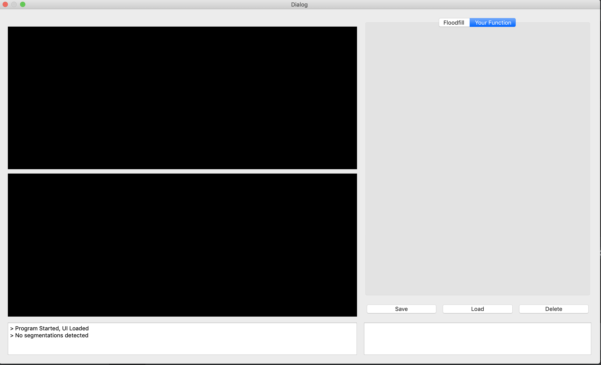
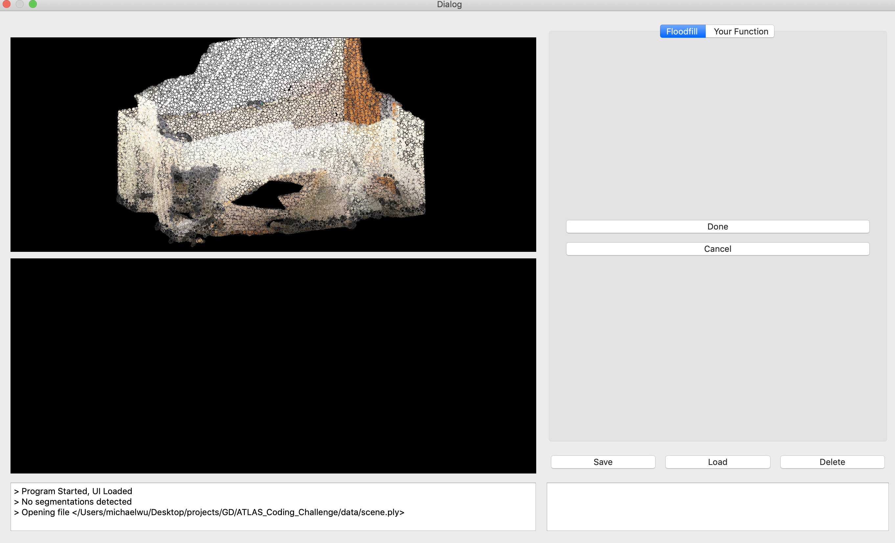

# ATLAS_Coding_Challenge
## I. Get Started
#### A. Basics
We do expect you to be familiar with Git. Please create your own repository for this coding challenge.
You may use 
`git clone https://github.com/wuxiaohua1011/ATLAS_Coding_Challenge.git` to get a copy of the skeleton code
#### B. Set up environment
We use Conda as our environment management tool
1. `conda create -n env_name python=3.7`
2. `conda activate env_name`
3. `pip install -r requirements.txt` \
To see if everything is working properly, run
`python main.py` and the following window should pop up

#### C. Sample Usage
1. Run the program with `python main.py`.
2. click on the *Floodfill* tab
3. click on the *Load* button
4. Select `data/scene.ply`
5. You should see this screen

6. click on any three points on a wall, and then click *Done*
7. you should see something like this

## Your Task
### Introduction
The goal of this project is to create a software that can help segment and label point clouds for the entire UC Berkeley. The design of this software will be quite complex due to the nature of how big the dataset is and the degree of flexibility that we need to incorporate into the design of this program. 

This coding challenge's goal is to 
1. access your capability to work with ambiguity
2. access your capability to work with open source libraries and codes with few documentation
3. access your capability to understand existing codebase

Please note that this coding challenge is representative of the work that you will be actually doing in the project.

Specifically, below are the functionalities that we want you to implement:

1. Any interactions(buttons, textfields, etc) you decide to implement should be in the *Your Function* tab
2. Display the original pointcloud in the upper display box(the upper display box with the room in the Sample Usage section)
3. Display an arbitrary cropped out pointcloud in the lower display box(the lower display box with the wall in the Sample Usage section)
4. Currently, when you click there are no points showing, but in the backend, it register a point click. We noted where you can display points in `main.py`, line 239. Implement when canvas is clicked, a point will be displayed functionality 

Stretch Goal:
1. In the Your Function tab, implement input fields that user can provide arbitrary X, Y, Z coordinates, and using those X,Y,Z coordinates, crop out the respective portion of the pointcloud. If any error occurs, write it in the `message_center` in the lower left corner
2. Implement function for saving and deleting. (Hint: saving is done for you, please see how we are doing it and make sure that you comply with the same schema)

### Deliverable:
- Please send us an email at XXX with the following content:
    1. The Github Repository URL that we can review your coding challenge
    2. Your Resume
- Please make sure that if you installed any external packages, indicate in the Get Started Section or revise the requirements.txt. You are responsible for making sure that the program runs on any computers, and that the we have no problem running and reviewing your code.
- Please make extensive comments in the files on where you revised/added code.

### Resources
Here are some of the major libraries that this project depends on. Please look into `main.py` to understand how these libraries are tied together.
- Open3D - http://www.open3d.org/ 
- VisPy - http://vispy.org/
- PyQt5 - https://www.riverbankcomputing.com/static/Docs/PyQt5/introduction.html

There are many tutorials/documentation online, feel free to use Google for more documentations.

#### Miscellaneous
- If at any point, you have any questions or concerns, please email us at XXX, we'll get back to you ASAP.
